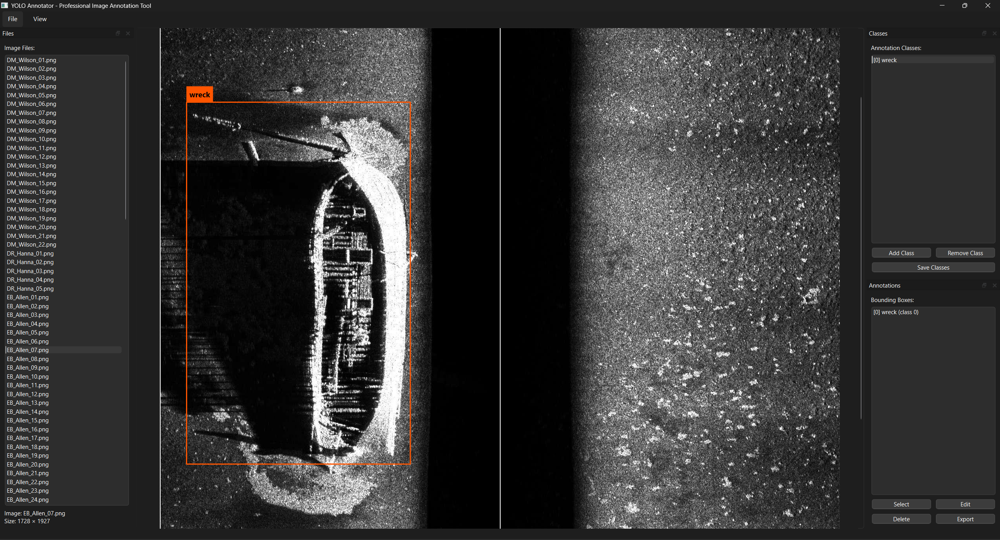

# YOLO Annotator

<p align="center">
  
</p>

<p align="center">
  <strong>Professional Image Annotation Tool for YOLO Format</strong><br>
  Designed for marine survey data, side-scan sonar imagery, and large-format scientific images
</p>

---

## About

YOLO Annotator is a lightweight **manual** image annotation tool specifically designed for creating YOLO format datasets. Users interactively draw and label bounding boxes to create training data for object detection models.

**Author:** Ahmed Fekry  
**LinkedIn:** [www.linkedin.com/in/ahmed-fekry07](https://www.linkedin.com/in/ahmed-fekry07)  
**Version:** 1.0  
**License:** MIT

---

## Features

- ✅ **YOLO Format Output** - Industry-standard format
- ✅ **Multi-Class Support** - Unlimited classes with custom IDs
- ✅ **Interactive Editing** - Move and resize boxes with visual feedback
- ✅ **Undo/Redo** - Full history tracking
- ✅ **Batch Processing** - Efficient workflow for multiple images
- ✅ **Resize Handles** - Visual corner handles for precise editing
- ✅ **Selection Sync** - Bidirectional sync between viewer and list
- ✅ **Keyboard Shortcuts** - Efficient annotation workflow

---

## Installation

### Windows Executable (Recommended)

Download `YOLO_Annotator.exe` from releases - no installation needed!

### From Source

```bash
pip install PyQt6 Pillow
python app.py
```

---

## Keyboard Shortcuts

| Shortcut | Action |
|----------|--------|
| Ctrl+O | Open image |
| Ctrl+D | Open directory |
| Ctrl+S | Save annotations |
| D / A | Next / Previous image |
| Ctrl+Z | Undo |
| Ctrl+Y | Redo |
| Delete | Delete annotation |
| F | Fit to window |
| Mouse Wheel | Zoom in/out |
| Middle-click + Drag | Pan image |
| Left-click + Drag | Create bounding box |

---

## Screenshot
   
   
   *Example: Annotating a shipwreck in side-scan sonar imagery*
   
   **Dataset Credit:** Side-scan sonar imagery from [AI4Shipwrecks](https://github.com/umfieldrobotics/ai4shipwrecks) repository.

## License

MIT License - Copyright (c) 2025 Ahmed Fekry

---

**Contact:** [www.linkedin.com/in/ahmed-fekry07](https://www.linkedin.com/in/ahmed-fekry07)
